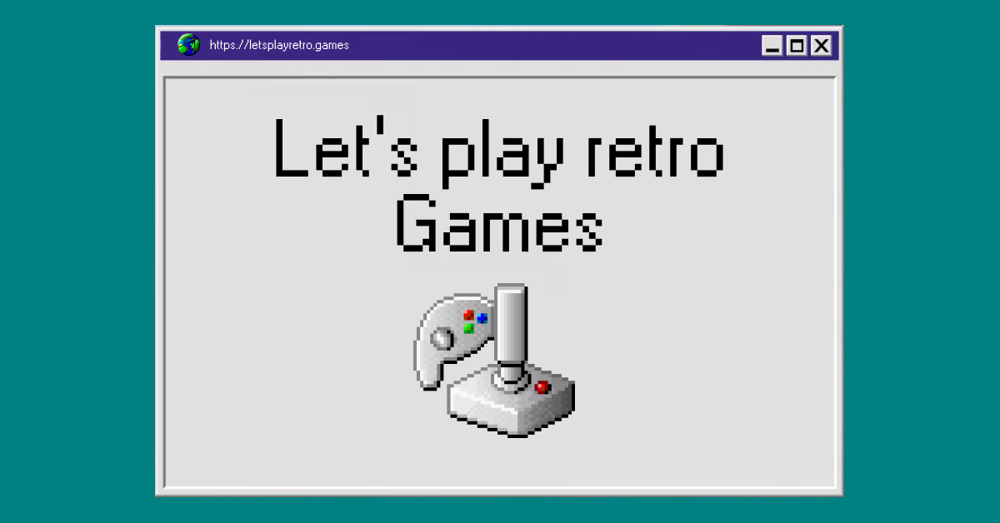

# Let's play retro games



Website to hold all the magic that is retro games.

### Features

- 🎲 Select a random game from a console
- 🎮 Search in all consoles
- 🕹 See all games in consoles
- 🔐 Create account and mark games as:
  - 🕹 Playing
  - ✅ Finished
  - ❤️ Favorite

### Current Systems

- [x] NES
- [x] Super Nintendo
- [x] Nintendo 64
- [x] Game Boy
- [x] Game Boy Color
- [x] Game Boy Advance
- [x] Sega Genesis/Megadrive
- [x] Sega Master System
- [x] Game Gear
- [x] TurboGrafx-16
- [x] Playstation 1
- [x] Sega 32X
- [x] Virtual Boy
- [x] Sega Saturn

### Running locally

```bash
git clone git@github.com:SaraVieira/lets-play-retro-games.git
cd lets-play-retro-games
yarn
yarn prisma migrate dev
## this will be slow
yarn prisma db seed
yarn dev
```

Needed envs:

- DATABASE_URL: Postgres DB
- GITHUB_ID && GITHUB_SECRET: If you need to test login. The callback URL is `http://localhost:3000/api/auth/callback/github`

### Can I have your data?

All the data that's on the DB is stored on GitHub and feel free to download it

https://github.com/SaraVieira/lets-play-retro-games/tree/main/data/games

### License

Apache License 2.0
